# Lab 1: Getting Your Environment Ready

Welcome to your first lab! This lab is all about getting your environment ready and setting up a tenant and your browser to keep things organized.

> :bulb: Even if you already have your development environment setup, please review each step as there are some extra items specific to the rest of the labs!

<b>Legend</b>

|Icon|Meaning|
|---|---|
|:rocket:|Exercise|
|:apple:|Mac specific instructions|
|:shield:|Admin mode required|
|:bulb:|Hot tip!|
|:hedgehog:|Code catch-up|
|:warning:|Caution!|
|:books:|Resources|

<b>Exercises</b>

- [Lab 1: Getting Your Environment Ready](#lab-1-getting-your-environment-ready)
  - [:rocket: Exercise 1: Create your own Microsoft 365 Tenant](#rocket-exercise-1-create-your-own-microsoft-365-tenant)
      - [:books: Resources](#books-resources)
  - [:rocket: Exercise 2: Using browser profiles](#rocket-exercise-2-using-browser-profiles)
  - [Exercise 3: Adding trial licenses](#exercise-3-adding-trial-licenses)
  - [:tada: All Done](#tada-all-done)
- [Next](#next)

## :rocket: Exercise 1: Create your own Microsoft 365 Tenant

>:exclamation: This exercise is only required if you do not have already have access to a Microsoft 365 tenant and/or have the ability to create your own SharePoint site and list.
>
> Does your company give you access to creating SharePoint sites? Lucky you! Skip to the next exercise!
>

Using your own developer tenant will allow you to do some of the more advanced labs without having to worry about introducing changes to your production environment, or -- even worse -- having to beg your IT admins for permissions.

It is completely free, and your tenant will continue to renew every 90 days, or so, as long as you continue using it for development purposes.

It is a full production tenant, but you should make sure to treat it as a development environment only (e.g. don't use it as your new email domain or to store important business document).

Please follow your employer's security guidelines when using your development tenant. Do not store your company's un-redacted production data in your dev tenant, even if it is simply for testing purposes.

1. Using your browser in a new browser profile that you have just created, browse to <https://developer.microsoft.com/microsoft-365/dev-program>
   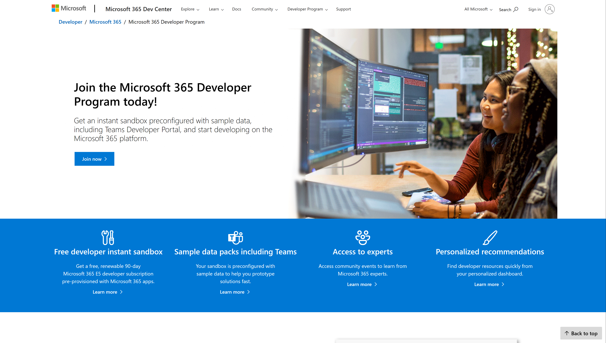
2. Under **Join the Microsoft 365 Developer Program Today!**, select **Join now**
3. When prompted to log-in, use your own Microsoft credentials (e.g. live.com, outlook.com -- not your corporate email address)
   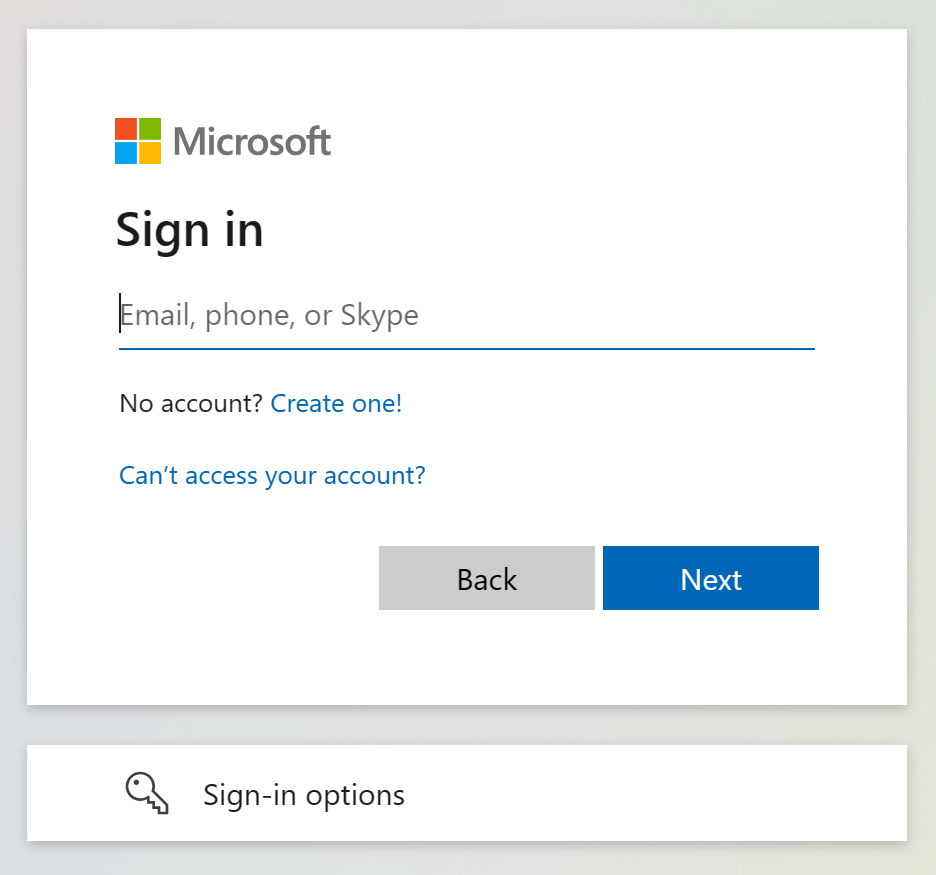
   > If you do not want to use your personal email address, you can create a new one by visiting https://live.com 
4. On the **Join the Microsoft Developer Program!** page, select your country for your **Country/Region** 
5. In the **Company** field, type a fictitious company that you want to use for your development tenant. For example, if your name is `April`, you may wish to use `April Dev`. **Do not use your work company name**
6. Select your **Language preference** and accept the terms and conditions. Whether you wish to receive information, tips, and offers is entirely up to you. Select **Next**
   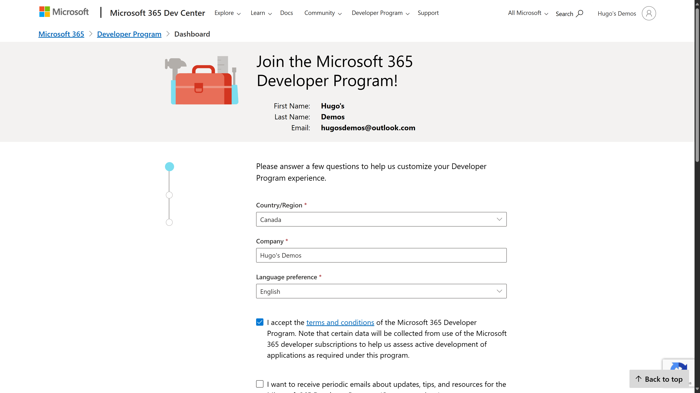
7. Select your **Applications for internal use at my company** as your **primary focus** and select **Next**
   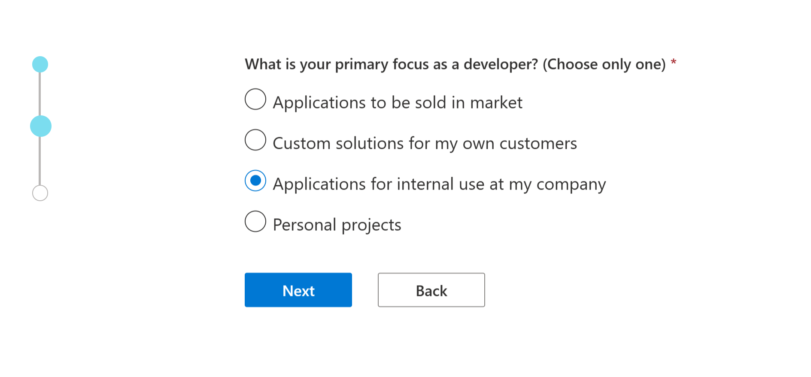
8. When prompted **What areas of Microsoft 365 development are you interested in?**, select whichever options you wish, but you *may* want to select **Power Platform** at a minimum. Select **Save**
   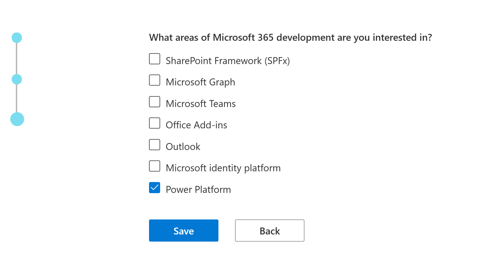
9. In the **Set up your Microsoft 365 E5 sandbox** dialog, when prompted to **Choose your Microsoft 365 E5 developer sandbox**, select **Instant sandbox**, and select **Next**. We won't have enough time today to configure your own sandbox from scratch.
   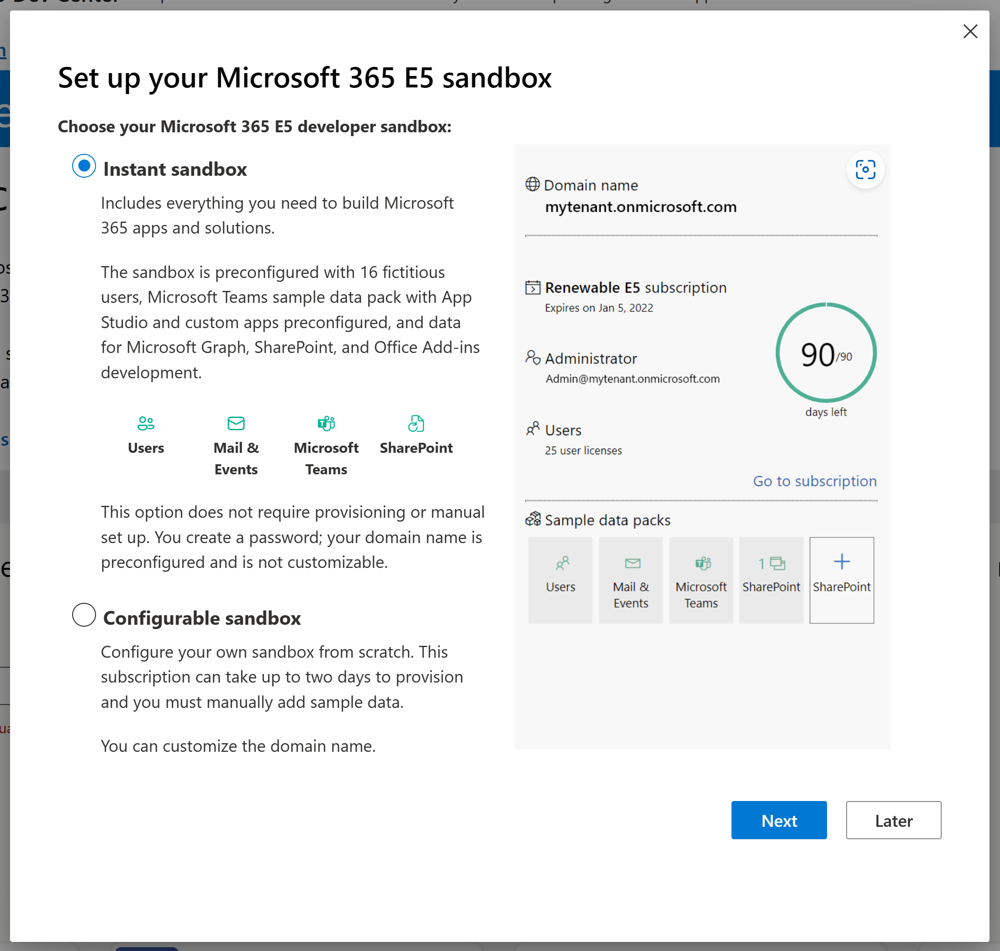
10. In the **Set up your Microsoft 365 E5 instant sandbox**, provide your desired **Admin username** (it will be unique to your tenant, so you can simply use your first name if you wish to)
11. Provide a new **Admin password** for your admin user (let's use a *new* password, shall we?!). Re-enter your new password in **Confirm admin password**.
12. By default, the system will create an additional 16 users with fictitious names and your same password to be used as for testing purposes. You may choose to enter a new alternative user password under **Use alternative password for all 16 fictitious users**
13. Select **Continue**
   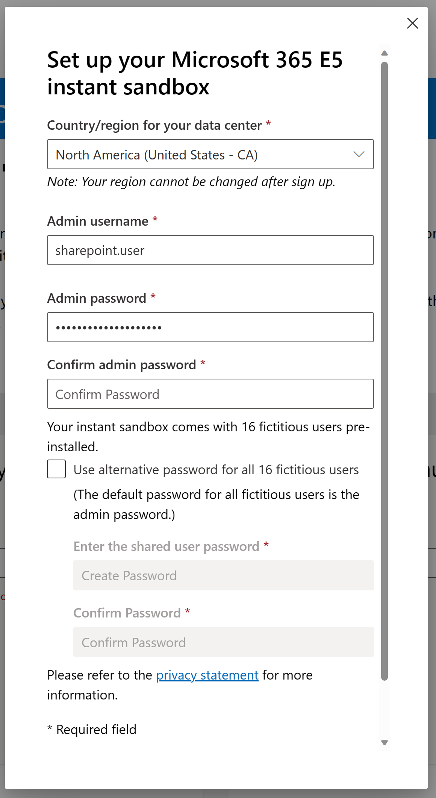
14. In the **Add phone number for security**, enter your mobile **Phone number** (and select the appropriate **Country code**), then select **Send code**
   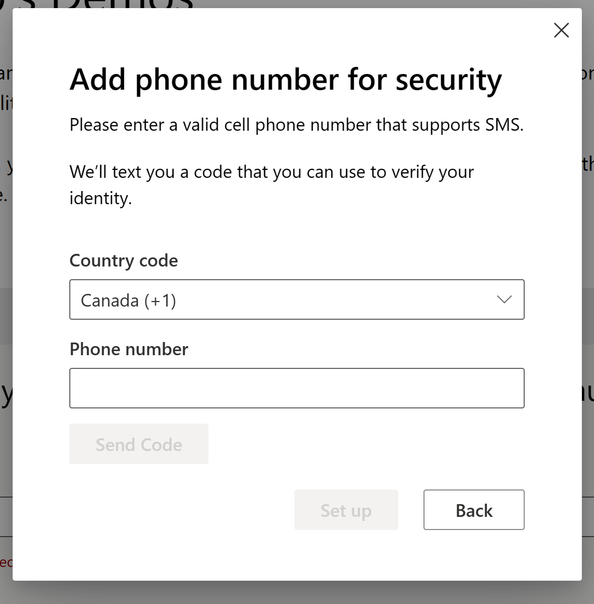
15. When you receive a code on your mobile device, enter the code and select **Set up**
    > If you get an error message when entering your phone number, it may be because you used your phone number too many times to create other developer tenants. A-hem, at least that's what I heard.
16. when your tenant setup is complete, it will redirect you to **Your Microsoft 365 developer subscriptions**, where it should display your tenant's **Domain name**
17. Select **Go to subscription**. If prompted to log-in, use the new admin credentials you configured for your tenants.
18. It may take a few moments for your tenant provisioning to complete. Click through the introduction guidance, and you should see the **Get started** page.
  

#### :books: Resources

- [Microsoft 365 Developer Program](http://aka.ms/m365devprogram)

## :rocket: Exercise 2: Using browser profiles

> :bulb: This exercise is optional, but will help dealing with authentication issues when switching between your work Microsoft 365 tenant and your dev tenant. Plus, if you don't follow these steps, we can't be friends anymore.

Browser profiles allow you to create a different instance of your browser, using different credentials, bookmarks, favorites, history, etc. This means you don't have to login repeatedly (as much) or accidentally end up logged into the wrong tenant while testing and pull out all your hair (see David and Hugo for relevant examples).

These instructions are for Microsoft Edge. You can also use **User profiles** in Chrome if you wish (instructions not provided but pretty similar)

1. Using Edge, reveal the profile menu by selecting your profile picture in the upper right corner.

   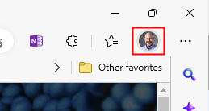
1. Find the **Add profile** menu (it may be located under **Other profiles** )

   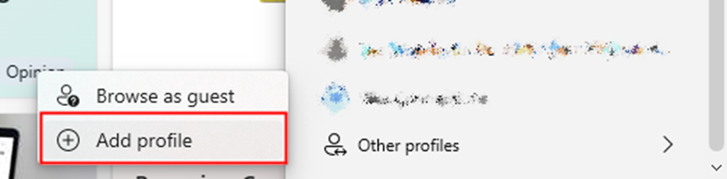

1. When prompted to **Add a profile**, select **Add**

   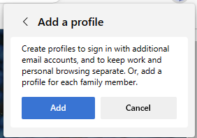

1. In the **Welcome to Microsoft Edge** dialog, select **Sign in to sync data**

   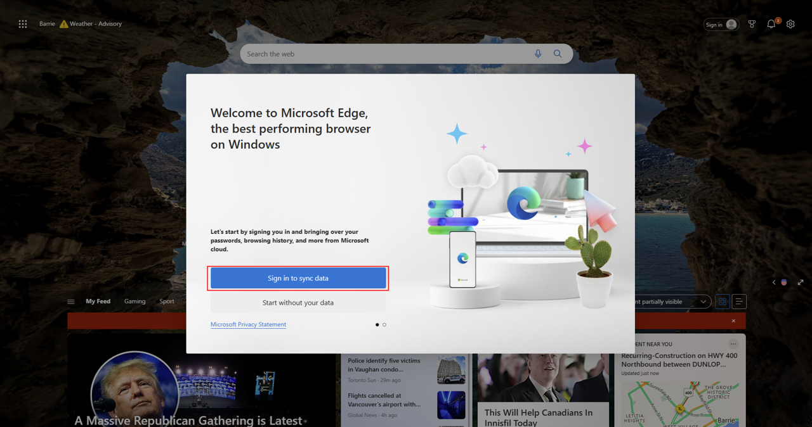

1. In the **Let's get you signed in** dialog, select **Add an account** followed by **Continue**

   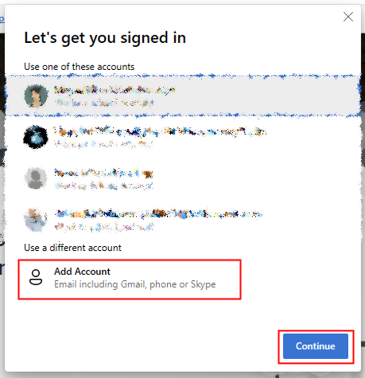

1. When prompted to **Enter email including Gmail or phone or skype**, enter the email address from your Microsoft 365 Dev tenant (**not** your work or personal email address), followed by **Sign In**

   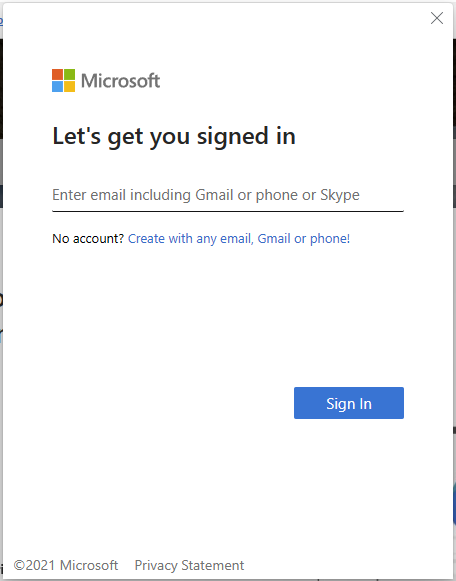

1. Follow the screen instructions to log in. If prompted to remember your password or keep signed in, feel free to say **Yes**. If you love things being difficult, feel free to say **No**.

1. Rename your new browser profile by using the profile menu and selecting the **Settings** icon

   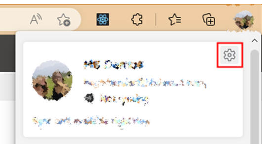

1. In the **Your profile**, select the **...** menu, followed by **Edit**

   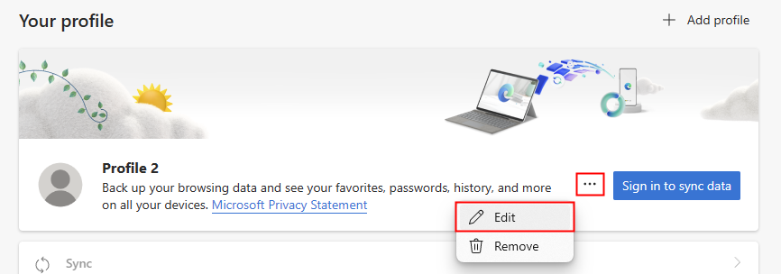

1. In the **Edit profile** dialog, change the profile name and select **Update**

   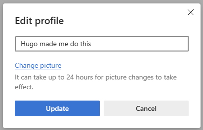

1. When you need to switch between user profiles, select the profiles menu and pick the profile you just created.

**For the rest of this workshop, we will use your developer tenant profile.**

## Exercise 3: Adding trial licenses

Many of the labs in this workshop will require you to get access to full Power Apps Per User license. To add some trial licenses, follow these steps:

1. From the **[Get started](<https://www.office.com/?auth=2>)** page, select the **Admin** icon in the navigation.
2. In the **Microsoft 365 admin center**, select **Billing**, followed by **Billing accounts**
3. Select the billing account associated to your developer tenant and enter your **Sold to address** to your own address, then hit **Save**.
   > Pssst. If you do not have an address in the United States, try using the address of your hotel.
4. In the left navigation, select **Purchase services**
5. In the **Purchase services** page, search for **Power Apps per user plan**. Select **Details**
6. In the **Power Apps per user plan** page, select **Start free trial**.
7. In the **Check out** page, select **Try now**
8. In the **Order receipt**, select **Continue**
9. While in the same browser profile, browse to <https://aka.ms/ppac>, which will take you to the **Power Platform Admin Center**
10. From the **Power Platform Admin Center**, select **Environments**
11. From the list of environments, select the one with the word **(default)** (there should be only one environment at this time)
12. In the environment details page, under **Environment admin**, select **See all**
13. In the **Environment Admin**, select **+ Add users**
14. In the **Add people to the Environment Admin security role** pane, enter your admin username and select **Add**
15. Using the breadcrumb at the top of the page, select your default environment to return to the environment details.
16. In the **Details** area, select **Edit**
17. In the **Edit details** pane, change the environment **Name** to **Personal productivity (default)** and select **Save**. This will rename your default environment, which is part of a sound [environment strategy](https://learn.microsoft.com/microsoft-365/community/defining-a-power-platform-environment-strategy#why-is-the-default-environment-special)

## :tada: All Done

In our next lab, we'll apply everything we've done so far to create a web part! Aw yeah!!

# [Next](../Lab02/README.md)
